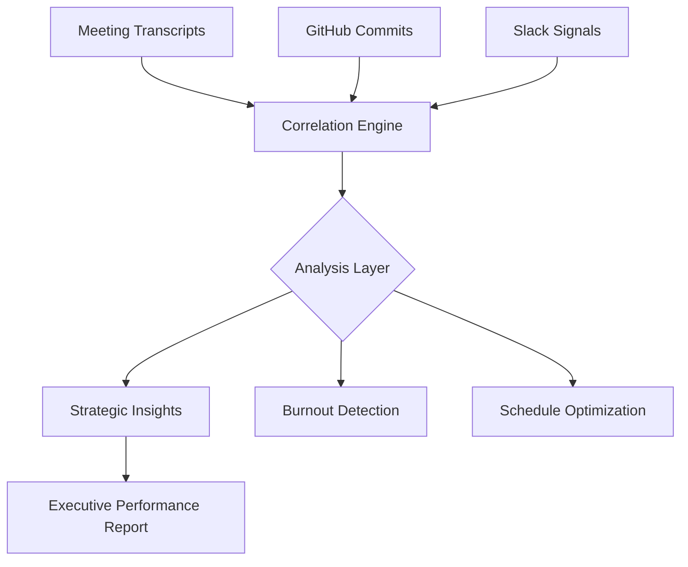

# 🧬 MeetingDNA

### **Decode the Engineering DNA of your Organization.**

MeetingDNA is a premium engineering analytics platform that translates complex organizational telemetry into strategic health insights. By correlating meeting density, commit velocity, and communication signals, the platform provides leadership with the high-resolution data needed to maximize team flow and minimize implementation drift.

---

## 🚀 Vision
In the modern engineering landscape, there is a mounting "visibility gap" between human interaction (meetings) and technical output (commits). **MeetingDNA bridges this gap.** 

Our platform doesn't just track metrics; it mines the "DNA" of your organization's work patterns to provide a high-fidelity map of team health, velocity, and focus.

---

## 🛠️ The Telemetry Pipeline



---

## 💎 Key Features

### **1. Universal Correlation Engine**
Our proprietary telemetry layer correlates meeting transcripts with downstream production commits. 
- *Impact*: Automatically detect "implementation drift" where discussions don't match technical execution.
- *Value*: ROI calculation for every engineering sync.

### **2. Schedule Optimization (Deep-Work Protection)**
Telemetry-driven calendar optimization designed to protect developer focus windows.
- *Scan for Conflicts*: Automatically identifies meetings during peak productivity hours.
- *Flow Impact*: Quantifies the "Focus Cost" of every meeting invitation.

### **3. Performance Coach Analytics**
A tailored "Performance Analyst" provides data-driven coaching based on individual developer telemetry.
- *Contextual Window*: Remembers past performance peaks to suggest optimal work blocks.
- *Human-Centric*: Switches from "Management Tool" to "Personal Growth Advocate".

### **4. Predictive Fatigue Monitoring**
Advanced physiological modeling to detect burnout risk before it impacts velocity.
- *Pre-emptive Signals*: Analyzes late-night commit patterns vs. morning meeting density.
- *Optimal Status*: Real-time dashboard of team health and sustainability.

---

## ⚙️ Technical Stack

- **Framework**: [Next.js](https://nextjs.org/) (App Router) — Enabling high-resolution, server-side rendered analytics.
- **ORM**: [Prisma](https://www.prisma.io/) with SQLite — For robust, type-safe data modeling.
- **Design System**: Vanilla CSS with **Glassmorphism** — A premium, enterprise-grade aesthetic that feels like the future of management software.
- **Analytics**: Heuristic-based insights and correlation logic for engineering-specific telemetry.

---

## 🏗️ Project Structure

```bash
src/
├── app/            # Routed pages (Dashboard, People, Predictive) & Analytics APIs
├── components/     # High-fidelity React components (Glassmorphism design)
├── lib/            # Shared logic (Analytics, Insights, Auth, Prisma)
└── styles/         # Global design tokens and animations
```

---

## 🚦 Getting Started

### 1. Requirements
Ensure you have **Node.js 18+** and **npm** installed.

### 2. Installation
```bash
git clone https://github.com/NIKHIL215-tech/meetingdna.git
cd meetingdna
npm install
```

### 3. Database & Telemetry Sync
Initialize the database and generate the telemetry client:
```bash
npx prisma generate
npx prisma db push
npx prisma db seed
```

### 4. Launch Development Environment
```bash
npm run dev
```

---

## 🔮 2026 Roadmap
- [ ] **Cross-Org Telemetry**: Benchmarking team health against industry standards.
- [ ] **Native IDE Integration**: Real-time "Focus Mode" triggers based on calendar scans.
- [ ] **Predictive Hiring Signals**: Using DNA patterns to identify team scaling needs.

---
© 2026 MeetingDNA. **Expert Engineering Analytics.**
